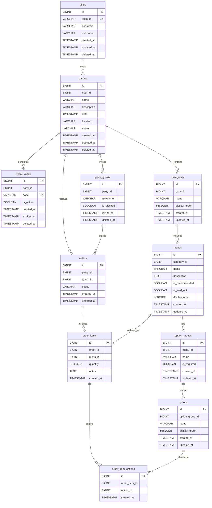

# Home Order

## 목차
- [개요](#개요)
- [기술스택](#기술스택)
- [ERD](#ERD)

---

## 개요

**Home Order**는 작은 규모의 홈파티나 모임에서 음식 주문을 효율적으로 관리할 수 있는 시스템입니다.

#### 🏠 호스트
- **회원가입**: 계정 생성 및 로그인
- **파티 관리**: 파티 생성, 수정, 삭제(취소)
- **게스트 관리**: 초대 코드 생성 및 파티 참여자 관리
- **메뉴 관리**: 카테고리별 메뉴 및 옵션 설정
- **주문 처리**: 파티 내 주문 현황 확인 및 상태 관리

#### 👥 게스트
- **파티 참여**: 초대 코드를 통한 파티 참여
- **주문 관리**: 개인 주문 생성, 취소

---

## 기술스택

### 백엔드
- **언어**: Kotlin
- **프레임워크**: Spring Boot

### 데이터베이스
- **RDBMS**: PostgreSQL
- **ORM**: Exposed ORM
- **마이그레이션**: Flyway

---

## ERD (Entity Relationship Diagram)

