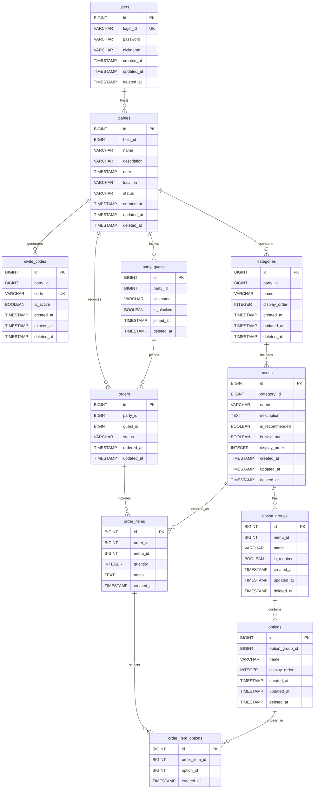

# Home Order

## 목차
- [개요](#개요)
- [기술스택](#기술스택)
- [프로젝트 구조](#프로젝트-구조)
- [상태 Enum](#상태-enum)
- [ERD](#ERD)

---

## 개요

**Home Order**는 작은 규모의 홈파티나 모임에서 음식 주문을 효율적으로 관리할 수 있는 시스템입니다.

#### 🏠 호스트
- **회원가입**: 계정 생성 및 로그인
- **파티 관리**: 파티 생성, 수정, 삭제(취소)
- **게스트 관리**: 초대 코드 생성 및 파티 참여자 관리
- **메뉴 관리**: 카테고리별 메뉴 및 옵션 설정
- **주문 처리**: 파티 내 주문 현황 확인 및 상태 관리

#### 👥 게스트
- **파티 참여**: 초대 코드를 통한 파티 참여
- **주문 관리**: 개인 주문 생성, 취소

---

## 기술스택

### 백엔드
- **언어**: Kotlin 1.9.25
- **프레임워크**: Spring Boot 3.4.5
- **빌드 도구**: Gradle (Kotlin DSL)
- **Java**: 17

### 데이터베이스
- **RDBMS**: PostgreSQL
- **ORM**: Exposed ORM 0.61.0
- **마이그레이션**: Flyway

---

## 프로젝트 구조

```
src/main/kotlin/com/wonjiyap/homeorder/
├── config/          # 설정 (Swagger, WebMvc, PasswordEncoder 등)
├── controller/      # 컨트롤러
│   └── dto/         # Request/Response DTO
├── domain/          # Entity (Exposed DAO)
├── enums/           # Enum (PartyStatus, OrderStatus, ErrorCode)
├── exception/       # 예외 처리 (HomeOrderException, GlobalExceptionHandler)
├── interceptor/     # 인터셉터 (AuthInterceptor)
├── repository/      # Repository 클래스
│   └── dto/         # 조회 파라미터 DTO
├── service/         # 서비스 레이어
│   └── dto/         # Param/Result DTO
├── tables/          # Exposed Table 정의
└── util/            # 유틸리티 (JwtUtil, AuthContext)

src/main/resources/
├── db/migration/    # Flyway 마이그레이션
└── application.yml  # 설정
```

## 환경 변수

| 변수명 | 필수 | 기본값 | 설명 |
|--------|------|--------|------|
| `JWT_SECRET` | O | - | JWT 서명용 비밀키 (최소 256bits) |
| `JWT_EXPIRATION` | X | 86400000 | JWT 만료시간 (ms, 기본 24시간) |

### IntelliJ 설정
Run Configuration > Environment variables에 추가:
```
JWT_SECRET=your-secret-key-at-least-256-bits-long
```

---

## 상태 Enum

### PartyStatus (파티 상태)
| 값 | 설명 |
|----|------|
| PLANNING | 계획 중 |
| OPEN | 주문 가능 |
| CLOSED | 주문 마감 |
| CANCELLED | 취소됨 |

### OrderStatus (주문 상태)
| 값 | 설명 |
|----|------|
| READY | 대기 중 |
| COMPLETED | 완료 |
| CANCELLED | 취소됨 |

---

## ERD

